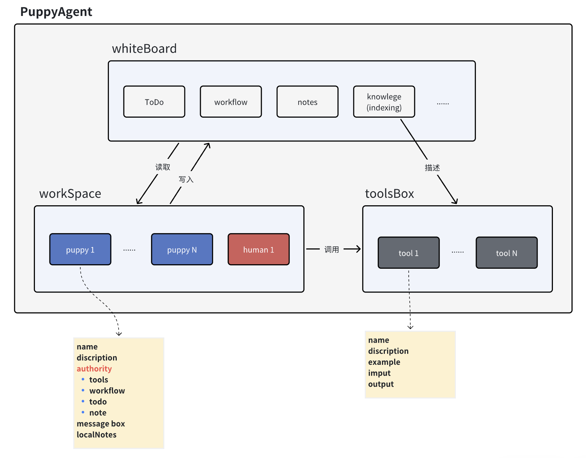

horizon.png)

An open-source **AI Agents-and-Humans Co-Working** framework

version, stars, website, document

### Five reasons that you should use PuppyAgent to create AI agents working with you.

1. **Human-Agent Interacts**: PuppyAgent allows the communication between human and agent in anytime. Even when the agent is running.
2. **Co-Working Agents**: PuppyAgent allows agents to co-work with each other, they can distribute tasks and share information automatically.
3. **Multi-Pipeline**: PuppyAgent allows agents to work in parallel, therefore, making the whole workflow robust and efficient.
4. **Scalable**: PuppyAgent is scalable, you can add, modify and remove tools and agents whatever you want.
5. **Open-source**: PuppyAgent is open-source, you can run it locally and don't need to worry about your information being leaked.

### Archietecture:

