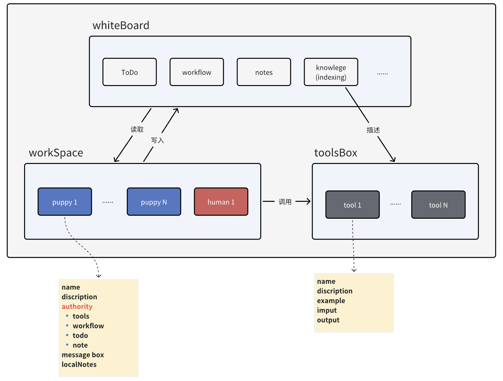

horizon.png)

An open-source **AI Agents-and-Humans co-working** framework

version, stars, website, document

* **Only Prompt Engineering**: PuppyAgent only involves prompt engineering, no fine-tuning, no pre-training.
* **Build Professional Agents**: PuppyAgent enable you to build an agent in two minutes.
* **Human-Agent Interacts**: PuppyAgent allows the communication between human and agent in anytime. You can instruct the agent even when the agent is running.
* **Multi-Agents**: PuppyAgent allows agents to co-work with each other, they can distribute tasks and share information automatically.
* **RAG**: Information Retriver is essential for agents. PuppyAgent offers an advanced information retrive framework, making your agent smarter!

### Archietecture:

### Everything is Agent:

All operations for notes, tools, workflows, indexing are responsible from agents.

