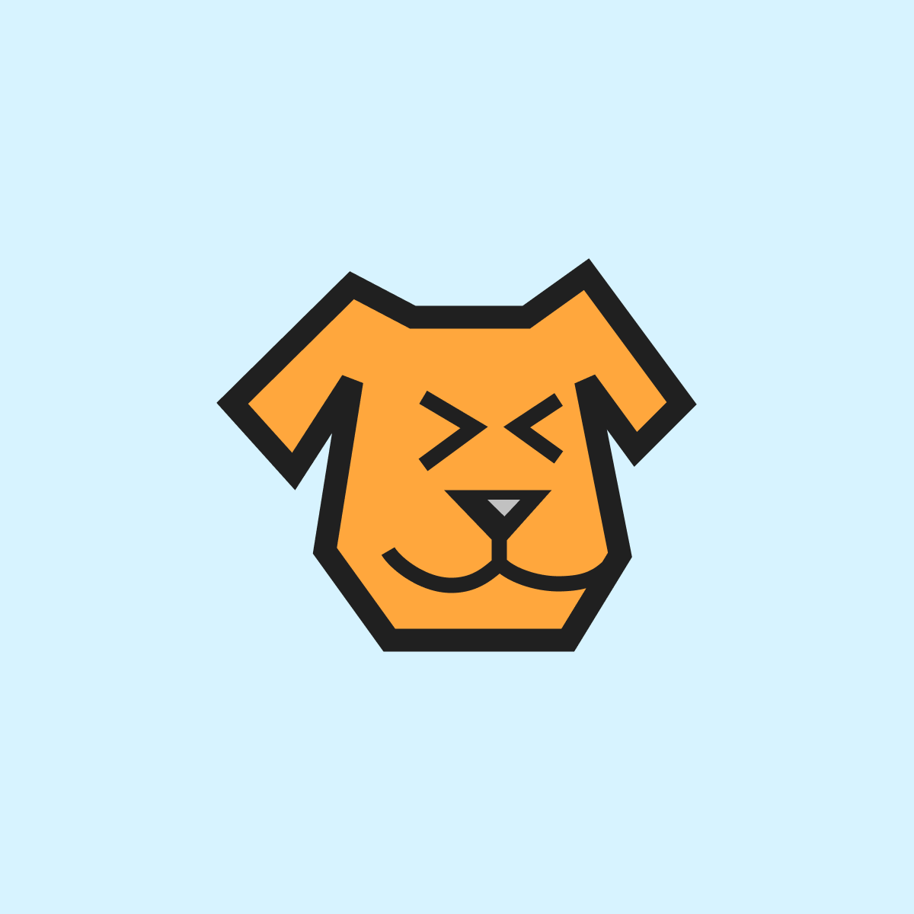
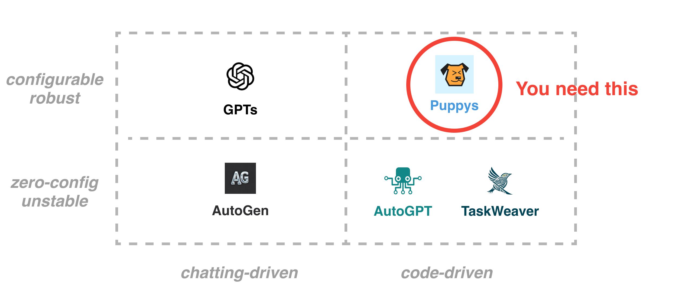
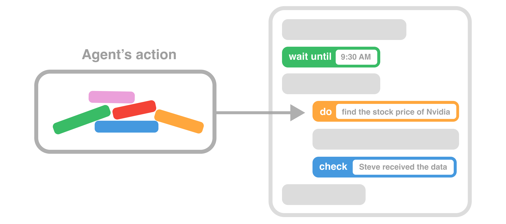
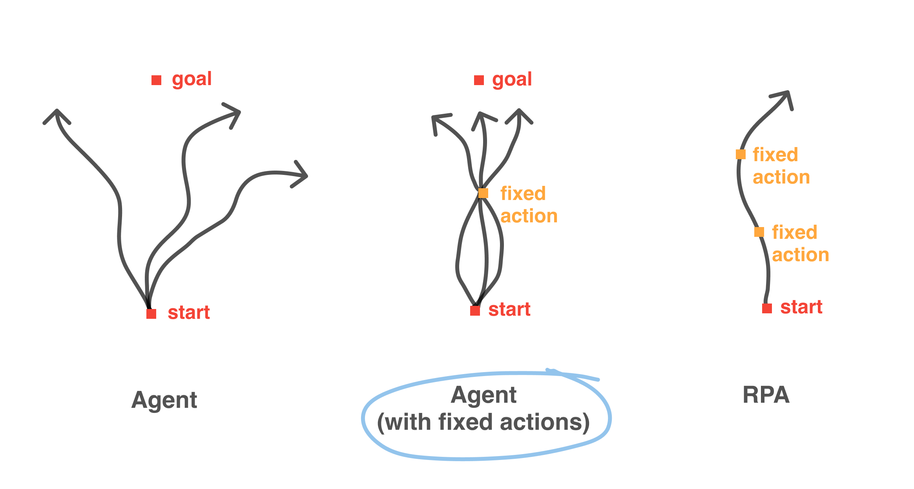
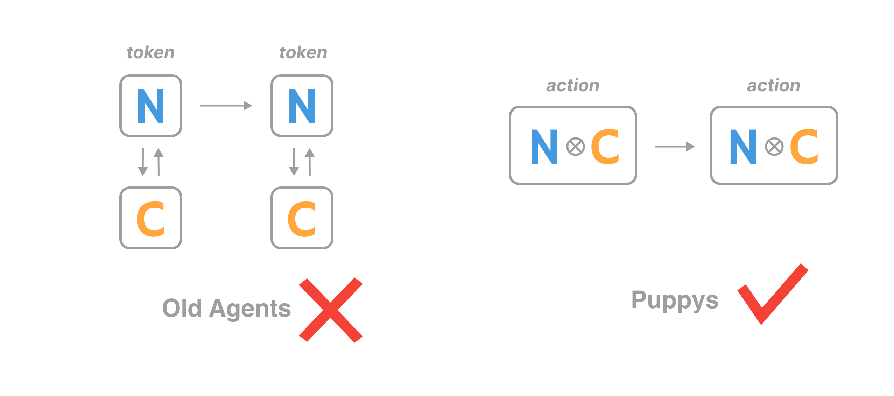

<div align="center">
    <picture>
      
    </picture>
    <h1 align="center">Puppys</h1>

**Framework for Plug-and-Play Agentic System**

**📜 [Document](https://mulberry-magician-e0a.notion.site/Puppys-document-83e2e55cfd27449589a6a721402ff4bc?pvs=4)**
&ensp;&ensp;
**🔌 [Install](https://mulberry-magician-e0a.notion.site/Install-453ccfa356a04eda865c68e489d0e6bf?pvs=4)**
&ensp;&ensp;
**⚽ [QuickStart](https://mulberry-magician-e0a.notion.site/Quick-Start-f4f383324012448180049f78035ccfa2?pvs=74)**

[](https://twitter.com/PuppyAgentTech) &ensp;
[](https://discord.com/channels/1249674961199829053/1249674961644163164)

## 
</div>


<div align="center">


-**Plug and Play**-

*Insert agentic ability into anywhere your existing enterprise code.*

-**Make Agent Robust**-

*Instruct agents via code, leading configurable and robust.*

-**Lite**-

*Less dependency, more scalability.*
</div>

<div align="center">

</div>


<div align="center">

## Plug-and-Play
</div>

Embed the agent's action into any your existing code, transforming your original code into an agentic system/

No DSL. No Workflow. Only Python (We understand that you don't like DSL or Workflow)

<div align="center">



</div>


<div align="center">

## Make Agent Robust

</div>

**Autonomous Agents** can do tasks by themselves and work in many situations, but only be able to solve very simple problems.

**RPA** (Robotic Process Automation), can handle complex tasks but isn't very flexible. 

We provide a hybrid solution of Agents and RPA.

<div align="center">

</div>


<div align="center">

## Code-Driven

</div>

 **An LLM predicts the next token**

 **An agent predicts the next action**. 

We believe that an LLM-based agent needs to predict the next action; in reality, it predicts the **next code**. This is the philosophy of being code-driven.
<div align="center">

</div>


## Quick Start & User Case

1. 📢 *Hacker News Reporter*

```
from puppy.pp.main import Puppy
from puppy.tools.usable_tools import UsableTools

# change the API key to your own
#os.environ["OPENAI_API_KEY"] = ""

def hacker_news_decisiontree(self):
    self.tool_box=UsableTools()

    self.do_check("go to https://news.ycombinator.com/ show the HTML")

    self.do_check("show the top 10 news, and send it to me")

    self.do_check("pick the news that related to Large Language Models, summarize all the news, and send it to me")


hacker_news = Puppy(decisiontree=hacker_news_decisiontree)

hacker_news.run()
```