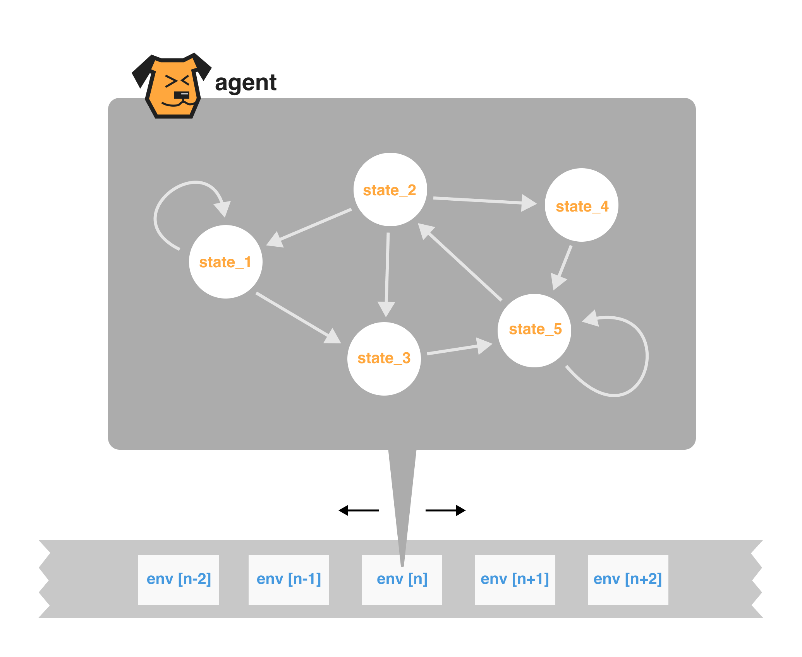

*An open-source **Code-Native AI Agents** framework*

<div align="center">

[](https://twitter.com/PuppyAgentTech) &ensp;
</div>

<div align="center">

**📜 [Document](https://mulberry-magician-e0a.notion.site/Puppys-document-83e2e55cfd27449589a6a721402ff4bc?pvs=4)**
&ensp;|&ensp;
**🔌 [Install](https://mulberry-magician-e0a.notion.site/Install-453ccfa356a04eda865c68e489d0e6bf?pvs=4)**
&ensp;|&ensp;
**⚽ [QuickStart](https://www.notion.so/Quick-Start-f4f383324012448180049f78035ccfa2)**

</div>

* **Code-Native**: Puppys is a code-native agent framework. Every dialog is code.
* **Multi-Threads**: Puppys enable you to build an agent with multi-thread.
* **Human-Agent Interacts**: Your agent will ask you when it cannot understand what you said.
* **tuning-machine-like agent**: program an agent by programming the agent's decision tree and its enviroment.

---

### Building an agent just like building an Tuning machine


When programming an agent, what exactly are we programming? 

To enable the agent to make the correct decisions upon encountering a specific state, we should define its **finite state machine (decision tree)**, and we might also need to define the **environment (tape)** in which the agent operates.

<div align="center">

</div>

---

### Hybrid solution of Agent and RPA

**Agents** can do tasks by themselves and work in many situations, but only be able to solve very simple problems.
**RPA** (Robotic Process Automation), on the other hand, can handle complex tasks but isn't very flexible. So, here is a question: **what if we make a hybrid agent that mix the advantages of agents and RPA?** Could this idea work?

Our solution is that, actionflow is as a list in the environment, which need to be interpreted by a decision tree.
Unlike previous agent frameworks, we placed the workflow within the environment, to be parsed by the decision tree, rather than a default flow.

<div align="center">

</div>

---

### Quick Start

1. *Hacker News Reporter*

```
import sys
import os
from puppy import Puppy

sys.path.append(os.path.dirname(os.path.dirname(os.path.abspath(__file__))))

# The name of agent is Mei
Mei = Puppy(name="Mei")


# change the API key to your own
os.environ["OPENAI_API_KEY"] = "Your_OpenAI_API_Key"


# define the agent's main thread's actionflow
@Mei.mainthread
def actionflow_pending():

    ## go to this website: "https://https://news.ycombinator.com/news/" , save its HTML. @python
    Mei.do()
    print(HTML_text)

    ## save the top 10 news name and their urls based on the HTML @gpt, and send the result to me
    Mei.do()


Mei.run()
```