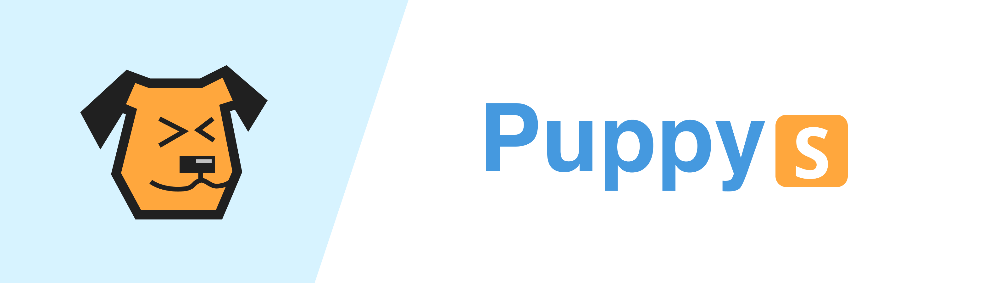
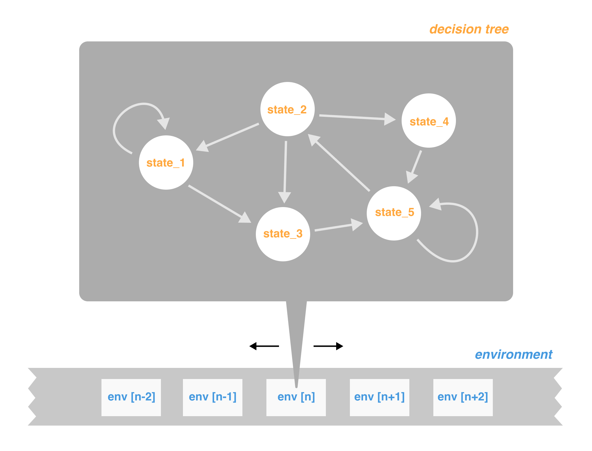

<div align="center">

*An open-source **Code-Native AI Agents** framework*

[](https://twitter.com/PuppyAgentTech) &ensp;
</div>

<div align="center">

**📜 [Document](https://mulberry-magician-e0a.notion.site/Puppys-document-83e2e55cfd27449589a6a721402ff4bc?pvs=4)**
&ensp;|&ensp;
**🔌 [Install](https://mulberry-magician-e0a.notion.site/Install-453ccfa356a04eda865c68e489d0e6bf?pvs=4)**
&ensp;|&ensp;
**⚽ [QuickStart](https://www.notion.so/Quick-Start-f4f383324012448180049f78035ccfa2)**

</div>

* **Code-Native**: Puppys is a code-native agent framework. Every agent's action is code.
* **Multi-Threads**: Puppys enable you to build an agent with multi-thread.
* **Human-Agent Interacts**: Your agent will ask you when it cannot understand what you said.
* **turing-machine-like agent**: program an agent by programming the agent's decision tree and its environment.

<div align="center">

**-------------  🔥 Version 0.0.21 (30-April-2024):  -------------**

</div>

1. **Updated FuncBase**: An easier way to create your func in agent's env
2. **Redisigned tool_box**: usable_tools is a default env in thread.
2. **Fixed bugs**: Fixed the bug of prompt and the func of 'send_message_to_human'


## Hybrid solution of Agent and RPA

**Agents** can do tasks by themselves and work in many situations, but only be able to solve very simple problems.
**RPA** (Robotic Process Automation), on the other hand, can handle complex tasks but isn't very flexible. So, here is a question: **what if we make a hybrid agent that mix the advantages of agents and RPA?** Could this idea work?

Our solution is that, actionflow is as a list in the environment, which need to be interpreted by a decision tree.
Unlike previous agent frameworks, we placed the workflow within the environment, to be parsed by the decision tree, rather than a default flow.

<div align="center">

</div>

## Building an agent just like building a Turing machine


When programming an agent, what exactly are we programming? 

To enable the agent to make the correct decisions upon encountering a specific state, we should define its **finite state machine (decision tree)**, and we might also need to define the **environment (tape)** in which the agent operates.

<div align="center">

</div>


## Quick Start & User Case

1. 📢 *Hacker News Reporter*

```
from puppy.thread.main import Thread
import sys
import os

os.environ['OPENAI_API_KEY'] = 'your_api_key_here'

hacker_news = Thread()

@hacker_news.actionflow.update
def pending_list():

    ## go to https://news.ycombinator.com/, save its HTML
    hacker_news.do()

    ## show the top 10 news @GPT and send message to the user
    hacker_news.do()


hacker_news.run()
```