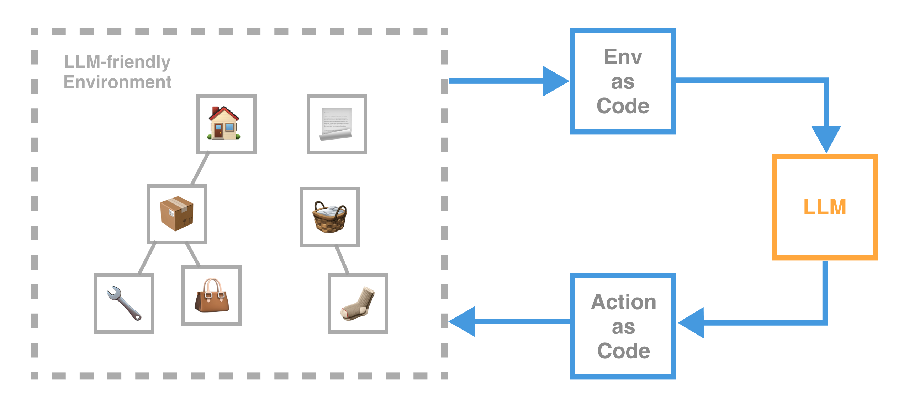

<div align="center">
      
    <h1 align="center">Puppys</h1>

**Environment-Oriented Programing Framework for AI Agents**

**🏠 [PuppyAgentTech](https://www.puppyagent.com/)**
&ensp;&ensp;
**📜 [Document](https://mulberry-magician-e0a.notion.site/Puppys-document-83e2e55cfd27449589a6a721402ff4bc?pvs=4)**
&ensp;&ensp;
**⚽ [QuickStart](https://mulberry-magician-e0a.notion.site/Quick-Start-f4f383324012448180049f78035ccfa2?pvs=74)**

[](https://twitter.com/PuppyAgentTech) &ensp;
[](https://discord.com/channels/1249674961199829053/1249674961644163164)

## 
</div>


<div align="center">


-**Environment-Oriented**-

*Build an LLM-friendly environment before building your agents.*

-**Code-Driven**-

*Environment, action and reasoning of agents are all based on codes.*

-**Plug and Play**-

*Insert agent’s ability into anywhere your existing code.*
</div>

<div align="center">

</div>


<div align="center">

## **Environment-Oriented Programming**

</div>
The most important thing for an agent to work is an agent-friendly environment. 

**Puppys** provides a framework that describe environment as agent can understand.


<div align="center">

</div>

<div align="center">

## Code-Driven

</div>

Code is the universal language for defining the behavior of LLM-based agents. 

**Puppys** provides a code-driven programming framework that allows agents to generate code based on the current environment to modify the environment accordingly.

<div align="center">

</div>


<div align="center">

## Plug-and-Play
</div>

Embed the agent's action into any your existing code, transforming your original code into an agentic system

No DSL. No Workflow. Only Python (We understand that you don't like DSL or Workflow)

<div align="center">


</div>


## Install

```
pip install git+https://github.com/PuppyAgent/Puppys.git
```


## Quick Start & User Case

1. 📢 *Hacker News Reporter*

```python
from puppy.pp.mei import Mei

# change the API key to your own
# os.environ["OPENAI_API_KEY"] = ""


def hacker_news_decisiontree(self):

    self.do_check("go to https://news.ycombinator.com/ show the HTML", show_response=True)

    self.do_check("show the top 10 news @llm, and send it to me", show_response=True)

    self.do_check("pick the news that related to Large Language Models, summarize all the news, and send it to me")


hacker_news = Mei(hacker_news_decisiontree)

hacker_news.run()

```

## Dependency
**[LiteLLM](https://github.com/BerriAI/litellm)**

## Contact Us
For collaboration, inquiries, career opportunities, and more, please contact:

**Founder:** guantum@puppyagent.com

**[Book a meeting with founders via Calendly](https://calendly.com/guantum/30min)**

**Our Team:** puppyteam@puppyagent.com
