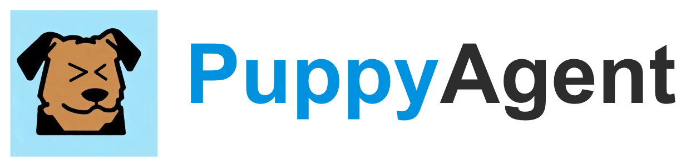

An open-source **Agents-and-Humans Co-Working** framework

Five reasons that you should use PuppyAgent to create your AI agents:

1. **Human-Agent Interacts**: PuppyAgent allows you to interact with agents anytime, even when the agent is running.
2. **Multi-pipeline**: PuppyAgent supports multi-agents running in parallel, therefore, making it possible to create a multi-agent system.
3. **Scalable**: PuppyAgent is scalable, you can add as many agents, tools, and notes as you want.
4. **Modular**: PuppyAgent allows you to modify any prompts and add your own functions.
5. **Open-source**: PuppyAgent is open-source, you can run it locally and don't need to worry about your information being leaked.

