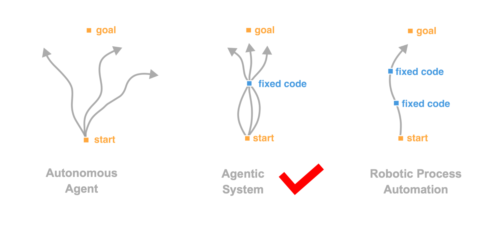

*Framework for Plug-and-Play Agentic System*


## Install

1. set up the local virtual environment (you can skip this if you want a global install)
    
    ```bash
    python3 -m venv my_env
    source my_env/bin/activate
    ```
    
2. clone the repository
    
    ```bash
    git clone https://github.com/PuppyAgent/Puppys.git
    ```
    
3.  install from the local project directory
    
    ```bash
    cd Puppys
    pip install -r requirements.txt
    pip install -e .
    ```
    
4. or you can install the repository directly from Github
    ```bash
    pip install git+https://github.com/PuppyAgent/Puppys.git
    ```

## Getting Started

### Configure your API key

First, you need a API key to access at least one large language model. For the capability of agent applications, we recommend ChatGPT 3.5+ from [OpenAI](https://help.openai.com/en/articles/4936850-where-do-i-find-my-openai-api-key).
The API keys should configured in environment variables,

1. In your project directory, create a file named `.env`. This file will contain your environment variables.

2. Open the `.env` file and add your environment variables in the format KEY=VALUE. For example:
```
OPEN_API_KEY=your_api_key_here
DATABASE_URL=your_database_url_here
```

If you want to enable more tools for your agent, e.g. search engine, you need to further configure their API keys. We use [perplexity search](https://www.perplexity.ai/) as the default search engine.

### A simple example
Here is a simple example that shows how to make an agent that can fetch news from internet, with only a few instructions.

First, we import a minimal agent template `Mei` from `Puppys`, which contains basic functionalities including LLMs request, web search, and Python script execution.
```python
from puppy.pp.mei import Mei
```
Next, we define the *action flow* for the `Mei`, which sets the goal or tasks for it to achieve. Here, a series of milestones are set in the action flow using the `do_check` method. The `do_check` method will instruct the agent to take actions for a milestone and regularly check whether the milestone is accomplished upon the completion of each action taken.
In this simple example, the agent is required to fetch some news from the "hacker news" webpage.

```python
def hacker_news_decisiontree(self, url):

    self.do_check("go to the given url, show the HTML", show_response=True)

    self.do_check("show the top 10 news @llm, and send it to me", show_response=True, show_prompt=True)

    self.do_check("pick the news that related to Large Language Models, summarize all the news, and send it to me")
```
While we call the method a "action flow", it can actually be a tree with many different branches. Hence, the logic and behavior of the agent will be straightforward. It will try to accomplish these milestones one by one by taking a flow of actions. More complicated action flows are possible to define using a combination of `do` and `check` (together as `do_check`) methods and the integrated compound statements (e.g. `if`, `while`) in Python.

```python
hacker_news = Mei(hacker_news_decisiontree)
hacker_news.run(url="https://news.ycombinator.com/")
```
Finally, we can pass the action flow as an argument to instantiate an agent called `hacker_news`. The agent will start working once the `run` method is invoked. 

## What Is an LLM Agent? 
A Large Language Model (LLM) or artificial intelligence (AI) agent is a specialized software entity that utilizes an LLM to perform various tasks autonomously.
For example, you may want your AI copilot to automatically write and execute a piece of code for you directly instead of telling you how to write it and letting you copy the code and run it yourself.
That simple step from *talking* to *doing* makes a huge difference between a chatbot and an agent.
Imagine you are the manager of a company. You may need consultants who advise you on what to do, but you will definitely need a hardworking team that can get the job done, and that is what LLM agents will be doing in the future.
This small step will make LLMs, or more generally, AIs, indispensable parts of human production and eventually change the way people work.

### Elements of an Intelligent Agent
What is the most basic difference between an LLM and an agent? Our answer to this question is:

- An LLM predicts the next token.
- An agent predicts the next action.

When you give your agent a task, the agent must be able to autonomously or interactively understand what needs to be done first, check what knowledge, data, or instruments are available or need to be used, and then decide how to solve the problem step by step; and finally, perform these actions one by one. If problems are encountered, the agent should also be able to adjust its strategy according to feedback or at least report these issues.
One can summarise these elements as follows: 
- Sensing
- Planning
- Executing
- Reacting

This is a highly simplified version of what an autonomous agent is expected to do. While this process seems relatively straightforward, in reality, it can be highly non-linear and involves a lot of uncertainties and iterations.

Predicting the next action is called *decision making* in cognitive science, which, as we know, is not only difficult for artificial intelligence but also challenging even for humans ourselves.

### Challenges for Decision Making

According to OpenAI, the ability of artificial intelligence can be ranked into five levels:
1. Chatbots
2. Reasoners
3. Agents
4. Innovators
5. Organizers

In 2024, state-of-the-art LLMs like GPT-4o are somewhere between level 2 and level 3. While LLMs have been successful at chatting, searching, and consulting, they still lack the ability to help people do tasks or jobs directly.

The reason is that predicting an action is much more complicated than predicting a token. More specifically, two major challenges exist in the decision-making process of LLMs. 

1. Enormous space for possible actions
2. Incomplete information on environments
   
Due to the two challenges listed above, LLMs-based agents are still a state-of-the-art concept instead of a ready-for-production technology. 
At the current moment, despite many exploratory works from various teams worldwide, there has yet to be a consensus in academics and industry about how a good agent should be designed or how it should behave. 


## Philosophy  of `Puppys` 
The `Puppys` is a framework for developing LLM-based agents. 
We hope the framework could make it easier for engineers and scientists to develop agentic systems and applications.

### Code Native Agent
Let us consider a fundamental question: How should an LLM agent actually *do* things or perform actions?
Our answer to this question is that **LLM agents do things via code**.
The ideal design for LLM-based agents should be that humans give verbal instructions, and LLM agents generate scripts or source code to solve these requests. The agent should be a translator between the nonexecutable natural language and the executable programming language. 
Unlike previous agent frameworks that make agents generate **natural language** and then convert to codes,  the`Puppys` framework is designed to *be code native*. When having the agent predict the next action, `Puppys` generates not only natural language to describe the action but also **code** that performs the actions.

<div align="center">

</div>
The programming language also provided a natural way to extend the ability of LLMs. Via a set of application programming interfaces (APIs), LLM-based agents can seamlessly interact with the existing software systems and use the available external instruments to perform many tasks beyond their original capability. 

### Hybrid Decision Making

Another fundamental question for LLM-based agents is how to make decisions or predict the next actions. As we discussed before -- delegating the decision-making process completely to the LLM behind an agent is not a *good* solution.
Our answer to this question is that considering the current capability of LLMs, we should leave the macro or strategic decision-making and planning to humans but delegate the micro or tactical decision-making and problem-solving to LLMs.
<div align="center">

</div>

Instead of allowing the LLM to make arbitrary decisions and act completely by itself, like in the case of autonomous system, the human user is required to set a series of *fixed milestones* in the path to the final goal, while the agent is allowed to make decisions and take actions between one milestone and the next. By reducing the size of possible action space and regulating the behaviors of agents, these milestones can effectively improve the robustness and efficiency of LLM-based agents. 

This hybrid decision-making for agents is implemented in the `Puppys` framework, allowing users to customize the logic level they would like to delegate to LLM when designing an agent.
